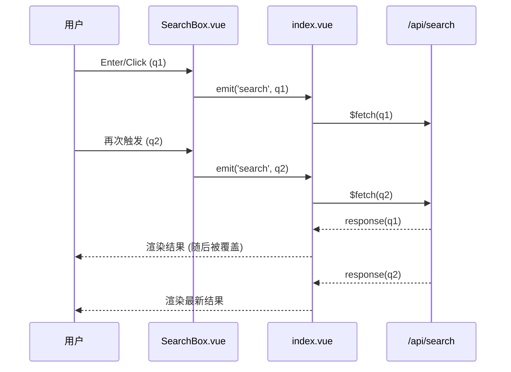
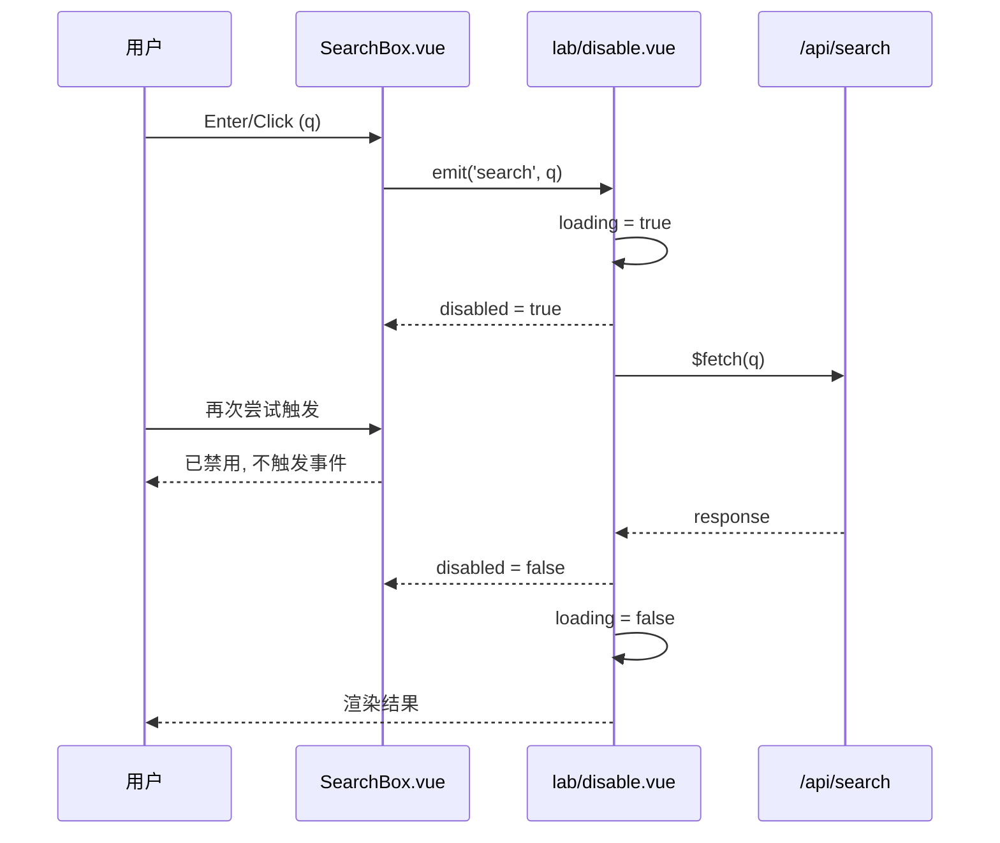
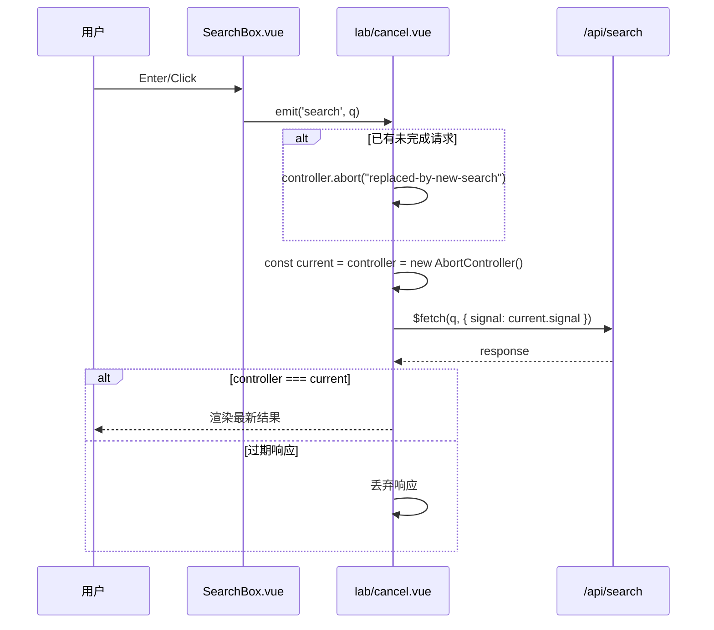

# 目标与范围

-   **核心目标**: 提供可运行的搜索功能 MVP, 包括输入, 后端检索, 前端展示, 关键词高亮与并发控制示例页.
-   **范围**: Nuxt 4 目录规范 (`app/`, `server/api/`), 内存数据源 (Nitro), 三种并发策略演示, 基础 XSS 防护与可访问性说明.

  

# 目录结构 (Nuxt 4)

-   `app/app.vue`: 应用入口, 启用 `<NuxtLayout>` + `<NuxtPage>`.
-   `app/layouts/lab.vue`: 示例页布局与导航.
-   `app/components/SearchBox.vue`: 搜索输入组件 (同词去重, 可禁用).
-   `app/components/SearchResults.vue`: 结果列表 (关键词高亮, 文本截断, 缩略图).
-   `app/pages/index.vue`: 无并发防护策略示例.
-   `app/pages/lab/disable.vue`: 请求期间禁用按钮策略示例.
-   `app/pages/lab/cancel.vue`: 取消上一次请求 (仅最后一次有效) 策略示例.
-   `server/api/search.get.ts`: GET `/api/search?q=...`, 内存数据源 + 人为延迟.

  

# 数据模型

-   `SearchResult` (前后端一致):
    -   `id: string`
    -   `title: string`
    -   `summary: string`
    -   `coverUrl: string`

  

# 后端 API (Nitro)

-   路径: `GET /api/search`
-   查询参数: `q: string` (空或空白返回空数组)
-   行为: 大小写不敏感的 "包含匹配", 字段范围 `title`, `summary`; 返回条数限制 (当前为 5); 固定 `1000ms` 延迟便于观察并发.
-   返回: `SearchResult[]`

  

# 前端组件

-   `SearchBox.vue`
    -   内部状态: `query: Ref<string>`.
    -   交互: Enter/点击时 `emit('search', normalizedQuery)`.
    -   去重: 本地变量 `lastEmittedQuery`, 相同规范化词不重复触发.
    -   禁用: `props.disabled?: boolean`, 原生控件使用 `disabled`.
-   `SearchResults.vue`
    -   `props`: `{ results: SearchResult[]; query: string }`.
    -   高亮: 使用 `escapeRegExp` 构造正则, 逐段拼接, 将命中片段包裹 `<mark>`; 非命中片段经 `escapeHtml` 编码后通过 `v-html` 输出.
    -   文本截断: 标题单行省略; 摘要两行省略; 图片使用 `object-fit: cover`; `alt` 取自结果标题.

  

# 页面与并发策略

-   共同状态: `results`, `loading`, `error`, `appliedQuery` (搜索成功后再用于高亮, 避免错位).
-   无防护 (`/`): 直接请求, 不做并发控制.
-   禁用按钮 (`/lab/disable`): 请求期间传入 `:disabled="loading"`, 阻断重复触发.
-   取消上一次 (`/lab/cancel`): 使用 `AbortController` 取消旧请求, 以 "当前 controller 引用" 作为唯一标识; 仅当 `controller === current` 时落地结果与复位 `loading`, 否则丢弃过期响应.

  

# 架构与流程图

## 无防护 (可能并发)

 

## 禁用按钮 (请求期间禁用输入/按钮)

 

## 取消上一次请求 (仅最后一次有效)

  

# 安全 (XSS) 与高亮

-   风险点: 由于使用 `v-html` 输出高亮结果, 需进行防御性编码.
-   现有防护: `escapeHtml` 编码非命中片段; `escapeRegExp` 清理查询词中的正则元字符.
-   测试用例: `server/api/search.get.ts` 中的 ID 13–18 覆盖多类常见 payload, 验证不会执行脚本与事件属性.
-   生产建议: 接入 DOMPurify (或同等)在 `v-html` 之前做白名单清洗; 服务端同样进行输出编码与内容校验, 形成双层防护.

  

# 验收清单

-   输入任意关键词可触发后端检索; 标题与摘要命中片段以 `<mark>` 高亮.
-   标题单行、省略号生效; 摘要两行、省略号生效; 缩略图加载与裁切正常.
-   三页并发策略行为差异清晰:
    -   首页 (无防护) 会并发;
    -   禁用页在加载中按钮不可用;
    -   取消页仅最后一次请求结果生效, 前次会被取消.
-   XSS 用例以纯文本呈现, 不会执行脚本或事件.

  

# 可选优化 (按需择一推进)

-   接入 DOMPurify: 生产级 XSS 防护, 成本低.
-   分页与 "更多" 加载: 中等改动, 提升大数据量体验.
-   客户端缓存与请求去重: 低成本, 减少重复请求与优化响应速度.

 
